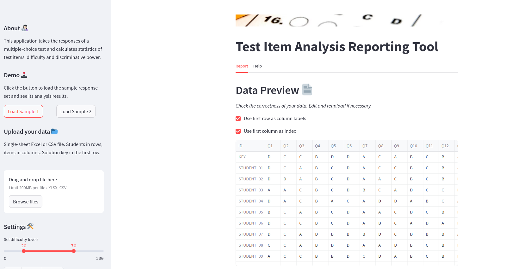

# Item analysis for tests

This project builds a Streamlit dashboard which generates an item analysis report for tests.

Test items (questions) can be multiple choice, true/false, or any combination of those.

## Screenshots


<table>
  <tr>
    <td> </td>
    <td></td>
   </tr> 
   <tr>
    <td> </td>
    <td></td>
  </td>
  </tr>
</table>

## Development setup

This project requires Python>=3.12 and streamlit>=1.38.

In the project directory, execute the following shell commands to create a virtual environment and install required packages.

```bash
$ python -m venv .venv
$ source .venv/bin/activate
$ pip install -r requirements.txt
```

## Running and viewing the dashboard
The following shell command starts the application.

```bash
$ streamlit run dashboard.py
```

This will automatically open a browser window and display the app. If it does not, direct your browser to `http://localhost:8501`

To load a sample dataset, click on one of the "Load Sample" buttons on the sidebar.